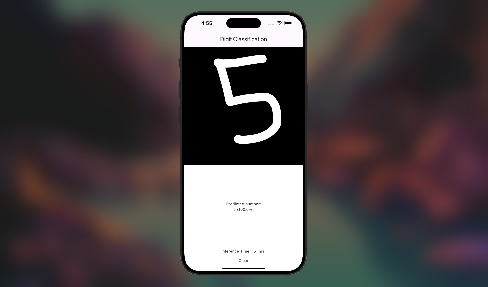

# digit_classification
A Flutter app that uses TensorFlow Lite to recognize handwritten digits using the MNIST model. Users can draw digits on the screen, and the app classifies them in real time.

